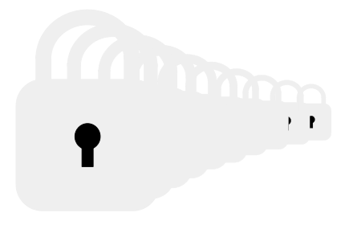

# Authunnel



Authunnel is an authenticated tunnel for reaching private TCP services, including SSH, through an OAuth2-protected TLS WebSocket conduit.

The target workflow is:

1. `ssh` launches the Authunnel client as `ProxyCommand`.
2. The client reuses a cached token, refreshes it, or completes Authorization Code + PKCE in a browser.
3. The Authunnel server, acting as an OAuth2 resource server, uses OIDC discovery to locate the issuer's JWKS endpoint and validates the JWT access token locally.
4. The server hosts a SOCKS5 backend and opens the requested `%h:%p` destination.
5. SSH stdio is bridged over that authenticated path.

## Components

- `server/server.go`
  - HTTPS server on a configurable listen address (default `:8443` for TLS-files, `:443` for ACME, `:8080` for plaintext-behind-reverse-proxy)
  - Conservative HTTP server timeouts to reduce slow-client resource exhaustion risk
  - Structured JSON logs with three correlation IDs:
    - `request_id` — generated per HTTP request; scoped to a single request/response cycle
    - `trace_id` — extracted from an incoming `Traceparent` header (W3C Trace Context) when present, otherwise generated; allows correlation with upstream infrastructure such as a load balancer or reverse proxy
    - `tunnel_id` — generated when a WebSocket upgrade succeeds; scoped to the lifetime of the SOCKS tunnel and inherited by all subsequent tunnel events (open, SOCKS CONNECT, close)
  - Tunnel logs include the authenticated user identity, with per-destination SOCKS CONNECT logs at debug level; all three correlation IDs are carried through so HTTP admission, tunnel lifecycle, and per-destination events can be joined
  - OAuth2 resource-server JWT validation: OIDC discovery used only to bootstrap the JWKS endpoint, all token verification done locally
  - Optional admission controls: global and per-user concurrent-tunnel caps, per-user tunnel-open rate limit, and a bounded dial timeout for outbound SOCKS CONNECT
  - WebSocket tunnel endpoint (`/protected/tunnel`) connected to an in-process SOCKS5 server
- `client/client.go`
  - **ProxyCommand mode**: stdio bridge for direct SSH integration
  - **Unix socket mode**: local SOCKS5 endpoint for generic client tooling
  - **Managed OIDC mode**: public-client PKCE login with token cache + refresh
  - Control-message listener for server-initiated longevity warnings; automatic token refresh when the server signals imminent token expiry

## How It Works

### Server flow

1. Reads OIDC issuer, audience, listen address, TLS mode, and connection longevity configuration from flags or environment.
2. Performs OIDC discovery once at startup, solely to locate the issuer's JWKS endpoint.
3. Accepts `GET /protected/tunnel`, verifies the bearer token's signature, issuer, expiration, audience, subject presence, `iat` sanity, and `nbf` (the token must be usable now at admission), then checks the WebSocket upgrade headers. Unauthenticated `GET` requests under `/protected/` receive `401`; other HTTP methods receive `405` from the router.
4. Applies admission controls (concurrent-tunnel caps and per-user rate limits) when configured, rejecting over-limit requests with `429`/`503` and a `Retry-After` header.
5. Upgrades the connection to WebSocket.
6. Hands each upgraded connection to the SOCKS5 server implementation.
7. If connection longevity is configured, manages tunnel lifetime: warns clients before expiry and disconnects when limits are reached. When token-expiry enforcement is active, the server accepts refreshed tokens from the client to extend the tunnel.
8. Emits structured JSON logs for request lifecycle, auth failures, tunnel open/close events, token refresh outcomes, and debug-level SOCKS CONNECT destinations.

### Client flow

1. Either:
   - uses a bearer token supplied via `--access-token` or the `ACCESS_TOKEN` environment variable, or
   - runs managed OIDC mode when `--oidc-issuer` and `--oidc-client-id` are configured.
2. In managed mode the client:
   - reuses a cached token when it remains valid for more than 60 seconds,
   - otherwise refreshes it when a refresh token is available,
   - otherwise launches a browser to the IdP and listens on `127.0.0.1` for the callback.
3. The client opens an authenticated WebSocket connection to the Authunnel server.
4. A background control-message listener handles server-initiated longevity messages. When the server warns that the access token is about to expire, the client automatically obtains a fresh token (via its existing refresh logic) and sends it to the server to extend the tunnel.
5. In ProxyCommand mode it performs a SOCKS5 CONNECT for `%h:%p` and bridges `stdin/stdout`.
6. In unix-socket mode it exposes a local SOCKS5 endpoint and opens a dedicated tunnel per local connection.

## Security Posture

Authunnel is deliberately simple in both functionality and implementation — a small, focused codebase that is intended to be easy to read and audit in full. Complexity is kept low by design; if a feature would make the security model harder to reason about, that is a reason not to add it.

### Required guarantees

The following properties are enforced by default with no silent bypass. Where a development override exists it is noted explicitly:

- **Bearer token validation** at the WebSocket layer before any SOCKS5 connection can be attempted: signature, issuer, audience (`aud`), expiry (`exp`), non-empty subject (`sub`), not-before (`nbf` must be usable at admission time, with a 30-second clock-skew allowance), and sane issued-at (`iat` must not be meaningfully in the future).
- **Subject pinning during token refresh**: the server rejects any refreshed token whose `sub` differs from the original tunnel's subject.
- **Refresh deadline enforcement**: a refreshed token whose `nbf` falls after the current enforced connection deadline (`exp + --expiry-grace`) is rejected. A refresh handover cannot silently extend the policy beyond what the operator has opted into. The comparison is strict — no additional clock-skew allowance applies beyond `--expiry-grace`.
- **Secure transport by default**: the OIDC issuer URL must be `https://`; the client's tunnel endpoint URL must be `https://` or `wss://`. Plaintext variants require explicit override flags (see *Development overrides* in the flag reference below).
- **Explicit egress posture at startup**: the server refuses to start without either `--allow` rules or `--allow-open-egress`. This prevents a misconfigured deployment from silently becoming an open TCP pivot.

### Operator-controlled

The following are disabled or unlimited by default and must be explicitly configured for a hardened deployment:

- **Egress allowlist** (`--allow`): limits the destinations authenticated clients may reach. Recommended for production; restricts the blast radius if a credential is compromised.
- **Egress open mode** (`--allow-open-egress`): explicit opt-in to allow any destination reachable by the server process. Logged at warn level on startup. Mutually exclusive with `--allow`.
- **Connection longevity** (`--max-connection-duration`, `--expiry-grace`, `--no-connection-token-expiry`): by default tunnel lifetime is tied to the access token's `exp`. These flags let operators tune for specific IdP behaviors or impose hard ceilings. Some IdPs (e.g. Auth0) cache access tokens; `--expiry-grace` extends the enforcement deadline beyond `exp` to give the client time to obtain a genuinely new token.
- **Admission limits** (`--max-concurrent-tunnels`, `--max-tunnels-per-user`, `--tunnel-open-rate`, `--dial-timeout`): zero or default by default. Configure for production to bound resource use and prevent a single credential from monopolising tunnel capacity or tying up goroutines on blackholed destinations.

### Known non-goals

- **Live token revocation**: revoking a token at the IdP does not terminate an already-established tunnel. Authunnel enforces token expiry but does not perform per-request introspection checks.
- **Tunnel chain observability**: Authunnel can only log and control connections it directly brokers. A client could SOCKS CONNECT to a second tunnel or proxy, creating a chain Authunnel cannot observe.
- **Session architecture redesign**: the current WebSocket-to-SOCKS model is intentionally simple and is not expected to change.

## Deployment Hardening Checklist

Before going to production, verify:

- [ ] OIDC issuer is `https://` — `--insecure-oidc-issuer` is **not** set.
- [ ] Tunnel endpoint is `https://` or `wss://` — `--insecure-tunnel-url` is **not** set on the client.
- [ ] Token-expiry enforcement is active — `--no-connection-token-expiry` is **not** set. By default, tunnels close when the access token expires and clients must refresh. Disabling this removes token expiry as a tunnel lifetime control; tunnels will still close at `--max-connection-duration` if set, but without that limit they persist until the client disconnects.
- [ ] At least one `--allow` rule is configured. `--allow-open-egress` should only appear in deployments where arbitrary authenticated egress from the server host is explicitly acceptable.
- [ ] A hard connection ceiling is set (`--max-connection-duration`) appropriate for your session-length policy.
- [ ] Admission limits are sized for expected load: `--max-concurrent-tunnels`, `--max-tunnels-per-user`, and `--tunnel-open-rate` are set.
- [ ] `--dial-timeout` is set (default `10s`). Setting it to `0` allows authenticated users to hold goroutines open on blackholed destinations indefinitely.
- [ ] The unix-socket path (if used) lives inside a private directory such as `/tmp/authunnel/` (`0700`), not directly under a world-writable parent like `/tmp`.
- [ ] The authunnel server (if using `--plaintext-behind-reverse-proxy`) is not directly reachable over untrusted networks — only the TLS-terminating reverse proxy should be. The proxy must also strip or overwrite client-supplied `X-Forwarded-Proto` / `X-Forwarded-Host` headers before forwarding.

## Usage

### Prerequisites

- Go 1.26.2+
- An OIDC provider that issues JWT access tokens carrying both a server audience (emitted as `aud`) and a non-empty `sub` — Authunnel pins each tunnel's refresh identity to `sub`, so tokens without one are rejected at admission. Most IdPs emit `sub` by default; on Keycloak 26+ the client's default scopes must cover it (the built-in `basic` scope, or an equivalent custom scope with an `oidc-sub-mapper` — see [`testenv/keycloak/authunnel-realm.json`](testenv/keycloak/authunnel-realm.json) for a working example)
- A TLS certificate trusted by the client runtime (for TLS-files mode; not required for ACME or plaintext-behind-reverse-proxy modes)

The **server** runs on Linux and macOS. The **client** runs on Linux, macOS, and Windows (10 1803 or later).

### Start server

Choose one TLS mode. All modes also accept `--oidc-issuer`, `--token-audience`, `--listen-addr`, `--log-level`, and `--allow`.

**Egress posture is required at startup.** Either pass one or more `--allow` rules (recommended) or pass `--allow-open-egress` to explicitly opt into open mode. Running without either is rejected — see the "Security Posture" section above.

**TLS certificate files** (default `:8443`):

```bash
export OIDC_ISSUER='https://<issuer>'
export TOKEN_AUDIENCE='authunnel-server'
export TLS_CERT_FILE='/etc/authunnel/tls/server.crt'
export TLS_KEY_FILE='/etc/authunnel/tls/server.key'

cd server && CGO_ENABLED=0 go run . --allow '*.internal:22'
```

The server validates the TLS key file at startup on POSIX. The resolved
target must:

- be a regular file with no group or world permission bits (`mode &
  0o077 == 0`, e.g. `0600` or `0400`),
- be owned by the current user or by root — any other unprivileged owner
  could read the key, so accepting that ownership would defeat the
  "unreadable by others" contract,
- live under a parent chain that is itself safe against `rename(2)`.

Symlinks are followed so canonical certbot paths such as
`/etc/letsencrypt/live/<domain>/privkey.pem` work out of the box; both
the un-resolved and resolved parent chains are checked for ancestor
safety. As a final step the server opens the key once to confirm it can
actually read it, so an ACL or group-membership mismatch surfaces at
startup rather than mid-handshake. Any failure logs `tls_key_file_unsafe`
and exits. The cert file is public material and is not validated.

**ACME / Let's Encrypt** (default `:443`; server must be reachable on port 443):

```bash
export OIDC_ISSUER='https://<issuer>'
export TOKEN_AUDIENCE='authunnel-server'
export ACME_DOMAINS='authunnel.example.com'
export ACME_CACHE_DIR='/var/cache/authunnel/acme'

cd server && CGO_ENABLED=0 go run . --allow '*.internal:22'
```

Certificates are obtained and renewed automatically using the TLS-ALPN-01 challenge. The cache directory must be writable by the server process and should persist across restarts to avoid hitting Let's Encrypt rate limits. autocert writes Let's Encrypt private keys into this directory, so on POSIX the server applies the same ancestor + leaf checks used for the OIDC cache: the directory is created `0o700` if missing, and an existing one is rejected if it is group/world writable, owned by another unprivileged user, or sits beneath a permissive ancestor.

**Plaintext HTTP** (default `:8080`; for use behind a TLS-terminating reverse proxy):

```bash
export OIDC_ISSUER='https://<issuer>'
export TOKEN_AUDIENCE='authunnel-server'

cd server && CGO_ENABLED=0 go run . --plaintext-behind-reverse-proxy --allow '*.internal:22'
```

The server trusts `X-Forwarded-Proto` and `X-Forwarded-Host` for WebSocket origin checks. Most proxies forward these automatically; nginx requires explicit configuration:

```nginx
proxy_set_header Host $host;
proxy_set_header X-Forwarded-Proto $scheme;
```

**Security note:** The reverse proxy must strip or overwrite any `X-Forwarded-Proto` and `X-Forwarded-Host` headers supplied by clients before forwarding requests to the backend. If client-supplied headers are forwarded unchanged, a malicious client can set them to arbitrary values and influence the WebSocket origin check. Add the following to your nginx configuration to ensure this:

```nginx
proxy_set_header X-Forwarded-Host $host;
```

Caddy, AWS ALB, Traefik, and HAProxy overwrite these headers with trusted values by default.

Useful server flags and environment variables:

- `--oidc-issuer` or `OIDC_ISSUER`
- `--token-audience` or `TOKEN_AUDIENCE`
- `--listen-addr` or `LISTEN_ADDR` (default varies by TLS mode; see above)
- `--log-level` or `LOG_LEVEL` with default `info`
- `--tls-cert` or `TLS_CERT_FILE` — path to TLS certificate PEM
- `--tls-key` or `TLS_KEY_FILE` — path to TLS private key PEM
- `--acme-domain` or `ACME_DOMAINS` (comma-separated) — domain(s) for automatic ACME certificate; repeatable
- `--acme-cache-dir` or `ACME_CACHE_DIR` with default `/var/cache/authunnel/acme`
- `--plaintext-behind-reverse-proxy` or `PLAINTEXT_BEHIND_REVERSE_PROXY=true` — serve plain HTTP, trusting a TLS-terminating reverse proxy for transport security; `X-Forwarded-Proto` and `X-Forwarded-Host` are used for WebSocket origin checks
- `--allow` or `ALLOW_RULES` (comma-separated in env) — restrict outbound connections to matching rules; repeatable. At least one rule is required unless `--allow-open-egress` is set
- `--allow-open-egress` or `ALLOW_OPEN_EGRESS=true` — explicit opt-in for running with no allowlist; mutually exclusive with `--allow`. Use only when arbitrary authenticated egress from the server host is acceptable for the deployment
- `--insecure-oidc-issuer` or `INSECURE_OIDC_ISSUER=true` — allow a non-HTTPS OIDC issuer URL **(development only; do not use in production)**
- `--max-connection-duration` or `MAX_CONNECTION_DURATION` — hard maximum tunnel lifetime (e.g. `4h`, `30m`); default `0` (unlimited)
- `--no-connection-token-expiry` or `NO_CONNECTION_TOKEN_EXPIRY=true` — do not tie tunnel lifetime to access token expiry; by default expiry IS enforced and clients can refresh tokens to extend
- `--expiry-warning` or `EXPIRY_WARNING` — warning period before either longevity limit; default `3m`
- `--expiry-grace` or `EXPIRY_GRACE` — extend the connection deadline beyond the access token's `exp` claim to accommodate providers (e.g. Auth0) that cache access tokens; default `0` (no grace)
- `--max-concurrent-tunnels` or `MAX_CONCURRENT_TUNNELS` — server-wide cap on simultaneous tunnels; default `0` (unlimited). Over-cap requests receive `503 Service Unavailable` with `Retry-After`.
- `--max-tunnels-per-user` or `MAX_TUNNELS_PER_USER` — per-subject cap on simultaneous tunnels, keyed on the OIDC `sub` claim; default `0` (unlimited). Over-cap requests receive `429 Too Many Requests` with `Retry-After`.
- `--tunnel-open-rate` or `TUNNEL_OPEN_RATE` — per-user tunnel-open rate (tunnels/sec); default `0` (disabled). Exceeding the rate yields `429` with `Retry-After` derived from the token-bucket delay.
- `--tunnel-open-burst` or `TUNNEL_OPEN_BURST` — burst size for the per-user rate limiter; defaults to `ceil(rate)` when rate is set. Setting burst without rate is a startup error.
- `--dial-timeout` or `DIAL_TIMEOUT` — per-outbound-dial timeout applied to SOCKS CONNECT destinations; default `10s`. Bounds failure time against blackholed targets.

Admission rejections are emitted as structured `warn` log records with `event=tunnel_admission_denied` and a `reason` field (`global`, `per_user`, or `rate`), so operators can distinguish abuse from undersized limits without adding a metrics stack. Per-user policy is keyed on the OIDC `sub` claim; tokens without a stable subject are rejected earlier by the JWT validator before admission runs.

Rule formats: `host-glob:port`, `host-glob:lo-hi`, `CIDR:port`, `CIDR:lo-hi`, `[IPv6]:port`, `[IPv6]:lo-hi`

IPv6 addresses must use bracketed notation (`[addr]:port`). Unbracketed IPv6 is rejected at startup because the last-colon port split is otherwise ambiguous.

```bash
# Only allow SSH to *.internal and HTTPS to the 10.x network
authunnel-server --allow '*.internal:22' --allow '10.0.0.0/8:443'
# Or via environment variable (comma-separated)
ALLOW_RULES='*.internal:22,10.0.0.0/8:443' authunnel-server
# IPv6 example
authunnel-server --allow '[::1]:22' --allow '[2001:db8::1]:443'
# Explicit open mode (no allowlist) — only if arbitrary egress from the
# server host is genuinely acceptable for the deployment
authunnel-server --allow-open-egress
```

### Managed OIDC client mode

This is the intended `ssh` workflow.

Example SSH config entry:

```sshconfig
Host internal-host
  HostName internal-host
  User myuser
  ProxyCommand /path/to/authunnel-client \
    --tunnel-url https://localhost:8443/protected/tunnel \
    --oidc-issuer https://<issuer> \
    --oidc-client-id authunnel-cli \
    --proxycommand %h %p
```

On Windows with OpenSSH, use the full path with backslashes and quote it if it contains spaces:

```sshconfig
Host internal-host
  HostName internal-host
  User myuser
  ProxyCommand "C:\path\to\authunnel-client.exe" --tunnel-url https://... --oidc-issuer https://<issuer> --oidc-client-id authunnel-cli --proxycommand %h %p
```

Useful client flags:

- `--oidc-issuer`
- `--oidc-client-id`
- `--oidc-audience` to request a specific API/resource audience during managed login
- `--oidc-redirect-port` to use a fixed loopback callback port instead of a random one
- `--oidc-scopes` with default `openid offline_access`
- `--oidc-cache` with default `${XDG_CONFIG_HOME:-~/.config}/authunnel/tokens.json` (macOS/Linux) or `%AppData%\authunnel\tokens.json` (Windows)
- `--oidc-no-browser` to print the URL without attempting automatic browser launch
- `--access-token` to supply a bearer token directly (not recommended; mutually exclusive with all OIDC flags)
- `--tunnel-url` — tunnel endpoint URL. Secure schemes `https://` and `wss://` are accepted by default; plaintext `http://` and `ws://` require `--insecure-tunnel-url`. **Required.** May also be supplied via the `AUTHUNNEL_TUNNEL_URL` environment variable (the flag takes precedence)
- `--unix-socket`
- `--proxycommand`
- `--insecure-oidc-issuer` — allow a non-HTTPS OIDC issuer URL **(development only; do not use in production)**
- `--insecure-tunnel-url` — allow a non-HTTPS tunnel endpoint URL **(development only; do not use in production)**

On first use the client prints the authorization URL to `stderr` and tries to open the system browser. Subsequent runs reuse the cache or refresh token when possible.

### Manual token (not recommended; for testing only)

A pre-obtained bearer token can be supplied via the `ACCESS_TOKEN` environment variable or the `--access-token` flag. This is mutually exclusive with all managed OIDC flags.

```bash
export ACCESS_TOKEN='<access-token>'
cd client
CGO_ENABLED=0 SSL_CERT_FILE=../cert.pem go run . \
  --tunnel-url https://localhost:8443/protected/tunnel \
  --unix-socket /tmp/authunnel/proxy.sock
```

ProxyCommand example with a pre-supplied token:

```bash
/path/to/authunnel-client \
  --access-token "$ACCESS_TOKEN" \
  --tunnel-url https://localhost:8443/protected/tunnel \
  --proxycommand internal-host 22
```

### Unix socket SOCKS5 endpoint

```bash
cd client
CGO_ENABLED=0 SSL_CERT_FILE=../cert.pem go run . \
  --tunnel-url https://<host>:8443/protected/tunnel \
  --oidc-issuer https://<issuer> \
  --oidc-client-id authunnel-cli \
  --unix-socket /tmp/authunnel/proxy.sock
```

Use with `socat` in an SSH `ProxyCommand`:

```sshconfig
Host internal-host-via-socat
  HostName internal-host
  User myuser
  ProxyCommand socat - SOCKS5:/tmp/authunnel/proxy.sock:%h:%p
```

If the unix-socket parent directory does not already exist, the client creates
it with `0700` permissions. It also tightens the socket itself to `0600` so
other local users cannot connect by default on shared hosts.

On shared POSIX hosts the client fails closed if the socket's parent directory
is group- or world-writable, or if it is owned by another local user. It also
walks every ancestor up to the filesystem root: any ancestor directory a peer
can `rename(2)` past would let them swap the private subtree between
validation and bind, so ancestors that are writable by others without the
sticky bit, or owned by an unprivileged user other than the operator, are
rejected too. Sticky directories (the classic case is `/tmp`, mode `1777`)
are accepted as ancestors because sticky-bit semantics restrict renames to
the entry's owner — but the leaf must still be a private subdirectory (for
example `/tmp/authunnel/`, mode `0700`), so point `--unix-socket` at a file
inside it rather than directly at `/tmp/proxy.sock`. A bare filename like
`--unix-socket proxy.sock` is validated against the current working
directory under the same rules, so starting the client from a shared cwd
(such as `/tmp` itself) is refused. The same checks apply to the OIDC token
cache directory (`--oidc-cache`) and its advisory-lock companion file, so a
directory that is safe for the socket is also safe for cached tokens.

#### Token cache at rest

Managed OIDC mode writes the cached access token and refresh token to
`--oidc-cache` as plaintext JSON. Confidentiality on disk is enforced by
POSIX filesystem permissions alone: the cache file is created `0600` via
atomic rename, inside a `0700` directory whose ancestors have been
validated against peer `rename(2)` as described above.

The client also re-validates an existing cache file before reading it, so
a `tokens.json` left over from another tool with `0o644` (or any
group/world bit), with a foreign owner, or replaced by a symlink is
rejected with a `validate OIDC token cache:` startup error rather than
silently honoured. The fix is one of `chmod 600
~/.config/authunnel/tokens.json` (POSIX) or deleting the file and
re-authenticating; the validator deliberately does not auto-chmod, so
the audit signal is preserved.

This design matches the pattern used by most OIDC CLIs, but operators
should be explicit about what it does and does not defend against:

- **Defended:** read access by other unprivileged users on the same host,
  including concurrent attackers who can observe the config directory but
  not write into it.
- **Not defended:** the machine's root user, offline forensic access to an
  unencrypted disk or disk image, backups of the user's config directory,
  or any process running as the same uid (which by construction already
  has the same tokens available through the authunnel client itself).

If your threat model requires stronger at-rest protection, either run
authunnel on a system with full-disk encryption (so offline disk access is
excluded), or supply the access token directly via `--access-token` /
`ACCESS_TOKEN` from a secrets manager so no refresh token is ever
persisted by authunnel.

During listener creation the client restricts its process umask to `0o077`,
so the socket inode is created owner-only in the first place; the follow-up
`chmod` to `0600` is kept as a safety net for filesystems that ignore umask
on AF_UNIX bind. Stale-socket cleanup after a previous crash refuses to
remove anything other than a unix-domain socket owned by the current user,
so a regular file accidentally placed at the socket path will surface as an
error rather than being silently unlinked.

Unix socket mode works on Windows 10 1803 and later. Windows uses NTFS ACLs
rather than POSIX mode bits, so the parent-directory safety check there only
verifies that the target path exists as a directory; detailed ACL inspection
is out of scope and operators should rely on the default `%AppData%`
location, which is already user-scoped.

## OIDC Client Registration

For managed client mode, register a **public** OIDC client with:

- standard authorization code flow enabled
- PKCE required with `S256`
- loopback redirect URIs allowed for `http://127.0.0.1/*` or for a specific fixed callback such as `http://127.0.0.1:38081/callback`
- refresh tokens enabled
- scopes that include `openid` and `offline_access`
- an access-token audience that includes the Authunnel resource, for example `authunnel-server`

Some providers, including Auth0 custom APIs, require an explicit audience/resource parameter on the authorization request. Use `--oidc-audience` in those environments.

Some providers require an exact loopback callback URL instead of allowing a random local port. Use `--oidc-redirect-port` when you need to register a fixed callback URL in the IdP.

Some providers require extra configuration before `offline_access` can be requested successfully. When that is not configured, override the client with `--oidc-scopes openid` and rely on cached access tokens only.

## Testing

Run the fast suite:

```bash
go test ./...
```

Current fast coverage includes:

- client config validation for manual vs managed auth modes
- token cache reuse, mismatch rejection, and refresh-before-browser behavior
- PKCE callback state validation and stderr-only auth messaging
- SOCKS5 CONNECT request construction and handshake behavior
- bidirectional proxy forwarding behavior
- server authorization-header rejection and JWT audience validation
- WebSocket multiplexing: binary data round-trip, control message routing, interleaved text/binary frame handling, bidirectional control messages
- transport hardening: insecure OIDC issuer and tunnel URL rejection, secure-scheme enforcement on client and server
- token validation: `nbf` not-before enforcement, `iat` sanity check, non-empty `sub` requirement, refresh subject pinning, refresh deadline enforcement
- admission controls: global concurrent cap, per-user concurrent cap, per-user rate limiting (fake-clock deterministic), dial timeout against blackholed destinations, handler-level rejection with correct HTTP status and `Retry-After`
- egress posture: startup rejection when neither `--allow` rules nor `--allow-open-egress` is present, mutual exclusion between the two modes, env-var equivalents
- filesystem safety: unix socket directory permission checks (group/world-writable rejection, foreign-owner rejection), stale-socket cleanup refusal on non-socket paths, umask-tightened socket creation, token cache and lock directory safety

## Developer Notes

The codebase is intentionally split so the moving parts of the auth and tunnel
flows are easy to locate:

- [`client/client.go`](client/client.go)
  - CLI parsing
  - ProxyCommand and unix-socket tunnel setup
  - SOCKS5 client-side handshake and byte forwarding
- [`client/auth.go`](client/auth.go)
  - auth-mode abstraction
  - OIDC discovery, refresh, and Authorization Code + PKCE flow
  - token cache and lock-file coordination for concurrent `ssh` invocations
- [`internal/tunnelserver/tunnelserver.go`](internal/tunnelserver/tunnelserver.go)
  - issuer discovery and JWKS-backed JWT validation
  - HTTP route setup for protected endpoints
  - websocket-to-SOCKS bridge wiring
  - connection longevity management: token-expiry and max-duration enforcement, token refresh validation with subject pinning
- [`internal/wsconn/wsconn.go`](internal/wsconn/wsconn.go)
  - `MultiplexConn` adapter: wraps a `*websocket.Conn` as `net.Conn` for binary SOCKS5 data, routing text frames to a control channel for longevity messages (expiry warnings, disconnect, token refresh)

When changing the auth flow, keep these invariants intact:

- ProxyCommand mode must only write transport bytes to `stdout`; any user-facing auth output belongs on `stderr`.
- Managed OIDC mode must prefer cache, then refresh, then browser login, so repeated `ssh` runs stay fast and predictable.
- Server-side authorization must continue to fail closed on missing bearer token, invalid JWT signature, wrong issuer, expired token, wrong `aud`, missing `sub`, future `iat`, or (at admission) unreached `nbf`.
- Token refresh over the control channel must verify that the new token's subject matches the original tunnel's subject (subject pinning) and that its `nbf`, if in the future, is at or before the current enforced connection deadline (`exp + --expiry-grace`), so the handover stays within the deadline the operator has already opted into. Never send refresh tokens to the server; only access tokens travel over the control channel.

## Local Keycloak Test Environment

The repository includes a Keycloak-based development environment under `testenv/keycloak/`.

### 1) Start Keycloak

```bash
docker compose -f testenv/keycloak/docker-compose.yml up -d
```

This imports a realm with:

- realm: `authunnel`
- issuer: `http://127.0.0.1:18080/realms/authunnel`
- public client: `authunnel-cli`
- bearer-only resource client: `authunnel-server`
- test user: `dev-user` / `dev-password`

### 2) Start Authunnel server against Keycloak

```bash
export OIDC_ISSUER='http://127.0.0.1:18080/realms/authunnel'
export INSECURE_OIDC_ISSUER=true   # local Keycloak uses HTTP
export TOKEN_AUDIENCE='authunnel-server'
export TLS_CERT_FILE='../cert.pem'
export TLS_KEY_FILE='../key.pem'

cd server
# Local dev environment — opt into open egress since the destinations
# exercised by the example commands are loopback services
CGO_ENABLED=0 go run . --allow-open-egress
```

### 3) Start Authunnel client in managed mode

```bash
cd client
CGO_ENABLED=0 SSL_CERT_FILE=../cert.pem go run . \
  --tunnel-url https://localhost:8443/protected/tunnel \
  --oidc-issuer http://127.0.0.1:18080/realms/authunnel \
  --insecure-oidc-issuer \
  --oidc-client-id authunnel-cli \
  --oidc-scopes openid \
  --unix-socket /tmp/authunnel/proxy.sock
```

### 4) Exercise the SSH-style flow

Direct ProxyCommand-compatible invocation:

```bash
SSL_CERT_FILE=../cert.pem ./client/client \
  --tunnel-url https://localhost:8443/protected/tunnel \
  --oidc-issuer http://127.0.0.1:18080/realms/authunnel \
  --insecure-oidc-issuer \
  --oidc-client-id authunnel-cli \
  --oidc-scopes openid \
  --proxycommand localhost 22
```

Or via `socat` + unix-socket mode:

```bash
socat - SOCKS5:/tmp/authunnel/proxy.sock:localhost:22
```

## End-To-End Test

An opt-in Keycloak-backed end-to-end test is available:

```bash
AUTHUNNEL_E2E=1 go test ./client -run TestKeycloakProxyCommandManagedOIDCE2E -count=1
```

The GitHub Actions workflow in [`.github/workflows/keycloak-e2e.yml`](.github/workflows/keycloak-e2e.yml) starts Keycloak from `testenv/keycloak/docker-compose.yml` and runs that test in CI.

## Versioning

Authunnel follows [Semantic Versioning](https://semver.org/). A new major version may introduce breaking changes to configuration flags, environment variables, or the wire protocol. Check the release notes before upgrading across a major version boundary.

## License

See [`LICENSE`](./LICENSE).
